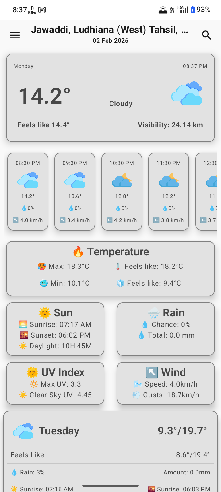
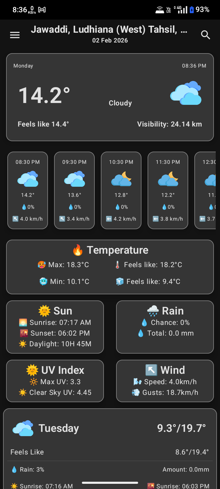
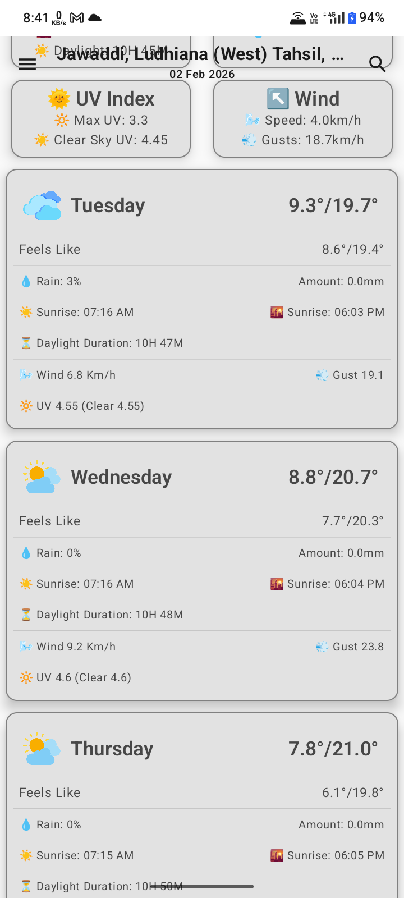
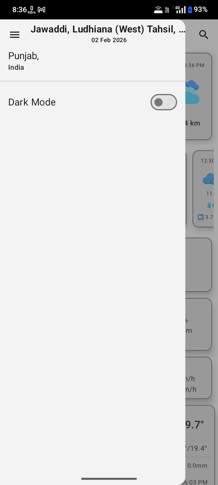
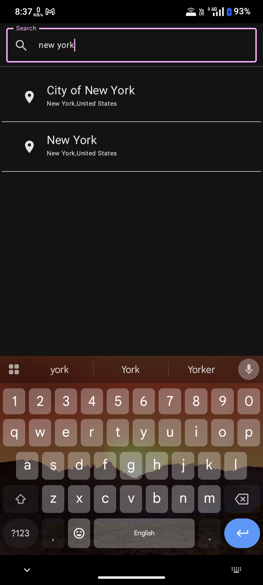

# 🌦️ Weather

A modern Android weather application built with **Kotlin** and **Jetpack Compose** that provides **current, hourly, and daily weather forecasts** with location search powered by a geocoding API.

---

## 📱 Features

- 🌡️ Current weather conditions  
- ⏱️ Hourly weather forecast  
- 📅 Daily weather forecast  
- 🔍 Location search using geocoding  
- 📍 Automatic location-based weather  
- 🌗 Light & Dark mode support  
- 🎨 Modern UI built with Jetpack Compose  

---
## 📷 Screenshots

<p align="center">
  
  
</p>

<p align="center">
  
  
</p>

<p align="center">
  
</p>


---

## 🛠️ Tech Stack

- **Language:** Kotlin  
- **UI:** Jetpack Compose  
- **Architecture:** MVVM  
- **State Management:** ViewModel + Compose State  
- **Networking:** Retrofit / OkHttp  

### APIs Used

- **Geocoding API** – for searching locations and resolving addresses  
- **Weather API** – for current, hourly, and daily weather data  

---

## 📊 Weather Data Includes

- Temperature (current, min, max, feels-like)  
- Sunrise & Sunset  
- Daylight duration  
- Precipitation (probability & total)  
- UV Index (normal & clear sky)  
- Wind speed & gusts  
- Weather condition codes  

---

## 🧩 App Architecture

```text
Jetpack Compose UI
        ↓
     ViewModel
        ↓
    Repository
        ↓
   Remote APIs
```
## 🚀 Getting Started

### Prerequisites

- Android Studio (latest recommended)  
- Android device or emulator  
- Internet connection  

### Clone the Repository

```bash
git clone https://github.com/sukhmmeet/Weather-Android-App
```
## Run the App

1. Open the project in Android Studio  
2. Sync Gradle  
3. Run on emulator or physical device  

---

## 🔐 API Configuration

Create a config file for API setup:

```kotlin
object ApiConfig {
    const val WEATHER_BASE_URL = "https://api.open-meteo.com/v1/"
    const val GEOCODING_BASE_URL = "https://geocode.maps.co/"
}
```
## 🎯 Future Improvements

- Save favorite locations  
- Weather alerts & notifications  
- Offline caching  
- Animations & transitions  
- Home screen widgets  

---

## 🤝 Contributing

Contributions are welcome.  
Fork the repository and submit a pull request.

---

## 📄 License

This project is licensed under the MIT License.  

---

## 👨‍💻 Author

Sukhmeet Singh Dhaliwal  
Android Developer | Kotlin | Jetpack Compose
